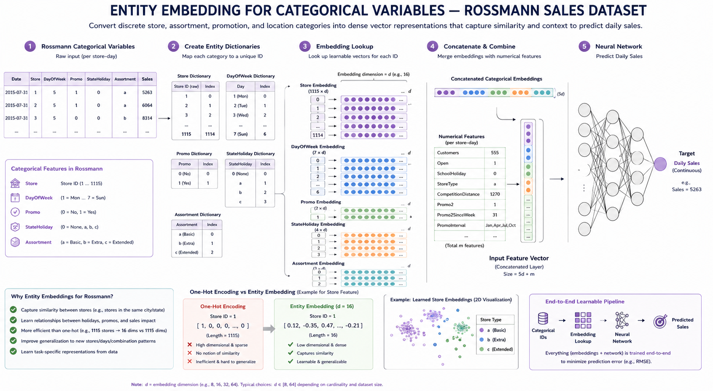

# Entity Embeddings of Categorical Variables



## 📌 Overview

This project implements the methodology described in the paper **[Entity Embeddings of Categorical Variables](https://arxiv.org/abs/1604.06737)**. By mapping categorical variables into a multi-dimensional space, we can capture complex relationships and similarities between categories, significantly improving the performance of neural networks on tabular data.

In this repository, we apply these techniques to the **Rossmann Store Sales** prediction task, demonstrating how entity embeddings can outperform traditional one-hot encoding by learning dense, meaningful representations.

---

## 📂 Project Structure

The codebase is organized into modular components for clarity and reproducibility:

| File | Description |
| :--- | :--- |
| `config.py` | Centralized configuration using `@dataclass` for baseline and ablation studies. |
| `data.py` | Data processing pipeline, feature engineering, and PyTorch `Dataset` / `DataLoader`. |
| `model.py` | Neural network architecture implementing the `RossmannEmbeddingModel`. |
| `train.py` | Main training loop, including ensemble model support and `wandb` logging. |
| `evaluate.py` | Script for evaluating trained models on test data. |
| `loss.py` | Loss function definitions (MSE, L1, etc.). |
| `metrics.py` | Performance evaluation metrics, specifically MAPE (Mean Absolute Percentage Error). |
| `utils.py` | Helper functions for reproducibility (seeding) and hardware acceleration (device detection). |
| `requirements.txt` | List of Python dependencies required to run the project. |

---

## 🚀 Getting Started

### 1. Installation

Clone the repository and install the dependencies:

```bash
pip install -r requirements.txt
```

### 2. Data Preparation

Ensure your dataset files are placed in the `data/` directory:

- `data/train.csv`
- `data/store_states.csv`

---

## 🧪 Running Experiments

### Training the Baseline Model

The baseline configuration uses random splitting and an ensemble of models for robust predictions:

```bash
python train.py --config baseline
```

### Running Ablation Studies

You can run various ablation experiments by specifying the corresponding config name:

| Config Name | Description |
| :--- | :--- |
| `ablation_time_based` | Uses time-based splitting instead of random splitting. |
| `ablation_embedding` | Tests different embedding dimensions. |
| `ablation_bn` | Incorporates Batch Normalization into the architecture. |
| `ablation_dec_lr` | Trains with a decreased learning rate. |
| `ablation_inc_lr` | Trains with an increased learning rate. |

Example command:

```bash
python train.py --config ablation_bn
```

---

## 📊 Evaluation

To evaluate a specific saved checkpoint, use the `evaluate.py` script:

```bash
python evaluate.py --config baseline --checkpoint models/baseline/baseline_1.pth
```

---

## 📝 Citation

If you find this work useful, please cite the original paper:

```bibtex
@article{guo2016entity,
  title={Entity embeddings of categorical variables},
  author={Guo, Cheng and Berkhahn, Felix},
  journal={arXiv preprint arXiv:1604.06737},
  year={2016}
}
```
